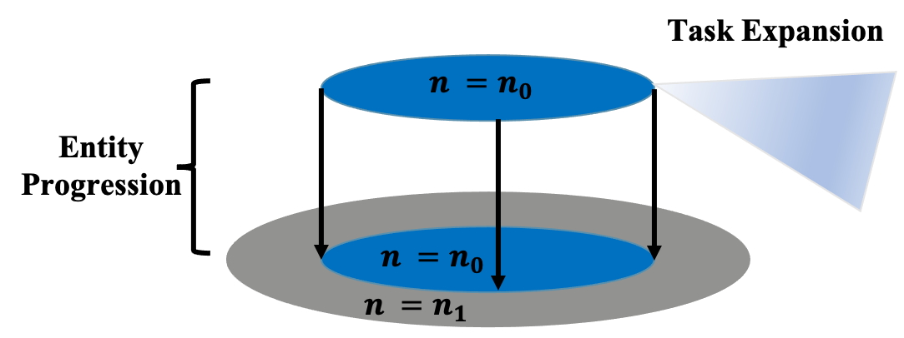

# Variational Automatic Curriculum Learning

Jiayu Chen, Yuanxin Zhang, Yuanfan Xu, Huimin Ma, Huazhong Yang, Jiaming Song, Yu Wang, Yi Wu.

Website: https://sites.google.com/view/vacl-neurips-2021

This repository implements a curriculum learning algorithm, Variational Automatic Curriculum Learning (VACL), for solving challenging goal-conditioned cooperative multi-agent reinforcement learning problems. The implementation in this repositorory is used in the paper "Variational Automatic Curriculum Learning for Sparse-Reward Cooperative Multi-Agent Problems" (). This repository is heavily based on https://github.com/marlbenchmark/on-policy.git.


<!-- <figure class="half">
    
    
</figure> -->

## 1.Install

test on CUDA == 10.0

```Bash
git clone https://github.com/jiayu-ch15/Variational-Automatic-Curriculum-Learning.git
cd ~/Variational-Automatic-Curriculum-Learning
conda create -n VACL python==3.6.2
conda activate VACL
pip install torch==1.5.1+cu101 torchvision==0.6.1+cu101 -f https://download.pytorch.org/whl/torch_stable.html
pip install -r requirements.txt
```

## 2. Train MPE

```Bash
   conda activate VACL
   cd scripts
   # run mpe without entity progression
   sh train_mpe_woEP.sh
   # run mpe with entity progression
   sh train_mpe_EP.sh
```
Cooperative scenarios:

- simple_spread
- push_ball
- hard_spread

## 3. Train Hide-and-Seek

### 3.1 Install MuJoCo

1. Obtain a 30-day free trial on the [MuJoCo website](https://www.roboti.us/license.html) or free license if you are a student. 

2. Download the MuJoCo version 2.0 binaries for [Linux](https://www.roboti.us/download/mujoco200_linux.zip).

3. Unzip the downloaded `mujoco200_linux.zip` directory into `~/.mujoco/mujoco200`, and place your license key at `~/.mujoco/mjkey.txt`.

4. Add this to your `.bashrc` and source your `.bashrc`.


``` 
   export LD_LIBRARY_PATH=~/.mujoco/mujoco200/bin${LD_LIBRARY_PATH:+:${LD_LIBRARY_PATH}}
   export MUJOCO_KEY_PATH=~/.mujoco${MUJOCO_KEY_PATH}
```

### 3.2 Intsall mujoco-py and mujoco-worldgen

1. You can install mujoco-py by running `pip install mujoco-py==2.0.2.13`. If you encounter some bugs, refer this official [repo](https://github.com/openai/mujoco-py) for help.

   ```
   sudo apt-get install libgl1-mesa-dev libosmesa6-dev
   ```

2. To install mujoco-worldgen, follow these steps:


``` Bash
    # install mujuco_worldgen
    cd envs/hns/mujoco-worldgen/
    pip install -e .
    pip install xmltodict
    # if encounter enum error, excute uninstall
    pip uninstall enum34
```

### 3.3 Train Tasks

``` Bash
   conda activate VACL
   cd scripts
   # box locking task
   sh train_bl.sh
   # hide and seek task
   sh train_hns.sh
```

## 4. Publication
If you find this repository useful, please cite our [paper]():

``` Bash
   
```

